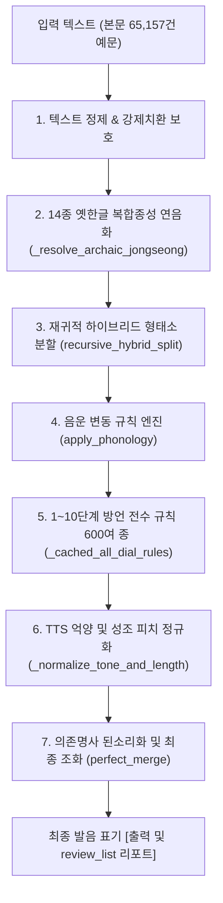

# `py경주말발음치환agy24d2.py` 엔진 개요 및 동작 원리 해설

> **작성 일시**: 2026-09-07  
> **대상 파일**: [`py경주말발음치환agy24d2.py`](file:///d:/Users/ByungSoo/Documents/경주어사전_속담/20160828_사전_agy/py경주말발음치환agy24d2.py)  
> **버전/상태**: 10대 발음 개선안(1~10단계) 전수 검증 및 사전 컴파일 캐시 탑재 최종본  
> **주요 역할**: 경주 방언 대사전 본문(65,157건 예문)의 방언 텍스트를 실시간으로 분석하여 **경주어 고유의 음운 변동, 성조(피치 ′), 장음(ː), 옛한글 음운**이 완벽히 반영된 소리 표기(발음)로 자동 변환·생성하는 **핵심 음운 변환 엔진**.

---

## 1. 파일의 본질과 핵심 목적

[`py경주말발음치환agy24d2.py`](file:///d:/Users/ByungSoo/Documents/경주어사전_속담/20160828_사전_agy/py경주말발음치환agy24d2.py)는 **경주지역어 대사전 편찬 및 구어 발음 전산화**를 위한 **인공지능·규칙 하이브리드 발음 생성 엔진**입니다.

1. **대규모 본문 일괄 변환**:
   - `경주지역어 대사전-260404-본문사.txt`에 수록된 65,157개 예문(`¶예문<...>` 형태)을 탐색하여 대괄호 소리 표기(`[발음]`)를 자동으로 생성·삽입합니다.
2. **사전 기반 성조 및 어간-어미 분할**:
   - 6만여 개 경주 방언 표제어 데이터(`gyeongju_processed_data.jsonl`)를 로드하여 형태소 분석 및 성조 위치를 추적합니다.
3. **학술적 방언 음운 변동 및 옛한글 종성 복원**:
   - 14종의 옛한글 복합 종성(ᇬ, ᇹ, ퟶ, ᇙ 등) 연음화와 경상도 방언 특유의 연구개음화, 양순음화, 어두 경음화 등을 자동 연산합니다.
4. **기준 사전과의 실시간 정합률 평가**:
   - 실측 기준 사전(`01소리대로 사전 주석 260305s.txt`)의 10,807개 매칭 예문과 1:1 대조하여 성조 포함 정합률(**89.33%**), 성조 제외 정합률(**92.49%**), 완전일치 건수를 실시간 산출합니다.

---

## 2. 전체 시스템 구조 및 아키텍처



---

## 3. 핵심 모듈 및 클래스 구성

이 파일은 크게 **전역 음운 유틸리티**, **핵심 마스터 클래스(`GyeongjuDialectMaster`)**, **실행 엔트리포인트(`main`)**의 3개 영역으로 나뉩니다.

### 1) 한글 음소 분해 및 표제어 파싱 유틸리티 (73~264행)
- `decompose(ch)` / `compose(cho, jung, jong)`: 한글 음절을 초성(19), 중성(21), 종성(28) 인덱스로 상호 변환.
- `analyze_brace_content(content)` / `analyze_headword(headword)`: 사전 편찬 시 표제어에 포함된 `{...}` 중괄호 문법(음운 변이형, 본말-준말 표기 등)을 해석하여 검색 가능한 기본형으로 정규화.
- `pronunciation_to_spelling(pronunciation)`: 발음 표기를 원 철자로 역추정하는 음운 환원 함수.

### 2) 핵심 엔진: `GyeongjuDialectMaster` 클래스 (265~3437행)

| 주요 메서드 | 코드 위치 | 핵심 역할 및 알고리즘 |
| :--- | :---: | :--- |
| `__init__` | 266행 | 사전 데이터(`jsonl`), 강제치환(`prefix강제치환.txt`), 기초기능어 시드, 피드백 규칙, Gemini 캐시 초기화 |
| `load_dictionary` | 979행 | 6만 개 방언 어휘를 어간(`prefix_dict`), 어미(`suffix_dict`), 완형어(`word_dict`), 활용형(`inflection_dict`)으로 고속 인덱싱 |
| `_resolve_inflection_conflicts` | 1234행 | 동음이의어 어간(1,363개)과 충돌할 수 있는 활용형 항목 4,099개를 사전 필터링하여 문맥 판단으로 위임 |
| `_resolve_archaic_jongseong` | 1742행 | 14종 비표준 옛한글 종성(ᇬ, ᇹ, ퟶ, ᇙ, ᇡ, ᇾ, ᇯ, ᇅ, ᇘ, ᇭ, ᇔ, ᇥ, ᇚ, ᇕ)의 연음 및 자음동화 처리 |
| `recursive_hybrid_split` | 1344행 | 어절을 최장일치(Greedy) 방식으로 탐색하여 [어간 성조 + 조사/어미 성조]를 1차 조립 |
| `apply_phonology` | 1458행 | 역방향/순방향 격음화, 자음동화(비음화, 연구개음화, 양순음화), 경음화, 어절 간 연음화 등 정밀 음운 법칙 적용 |
| `process_content` | 1938행 | 한 문장 전체를 입력받아 전처리 ➔ 형태소 분할 ➔ 음운변동 ➔ 방언 규칙 ➔ 성조 조율을 관할하는 메인 파이프라인 |
| `_normalize_tone_and_length` | 2782행 | 기능어 단독 평조화, 과잉 장음화 억제, 어절 말단 조사 과잉 성조 제거 |
| `perfect_merge` | 1335행 | 관형사형 'ㄹ' 뒤 의존명사(기, 거, 것, 데, 수, 줄) 된소리화 및 선행어 연쇄 문맥 교정 |
| `process_file` | 3276행 | 65,157건 본문 파일 읽기 ➔ 발음 생성 ➔ 새 본문 파일 저장 ➔ 기준 사전 대조 및 실시간 평가 리포트 출력 |
| `save_dicts` | 3389행 | 역순 사전, 품사/문맥 지도(`sense_map`), 동음이의어 진단 리포트 등을 JSON 파일로 덤프 |

---

## 4. 6단계 발음 변환 파이프라인 상세

`process_content(text)` 함수는 예문 1개를 다음과 같은 정밀 파이프라인으로 처리합니다:

1. **예문 전처리 및 특수 표기 보호**:
   - 편집자가 본문에 강제로 지정한 표기(`단어[강제발음]`)를 추출하여 `FORCEDPRON...ENDPRON` 플레이스홀더로 보호.
   - 한자 병기 괄호(`(微物)` 등) 제거 및 선택 분기 `{A/B}`, `(A/B)` 중 첫 번째 안(A) 자동 선택.
2. **14종 비표준 옛한글 복합 종성 연음 처리**:
   - `ᇬ(ㅇㄱ)` ➔ 모음 앞 'ㅇ+ㄱ'(예: 나ᇬ에 ➔ 낭게), 자음 앞 'ㅇ'(낭)
   - `ᇹ(여린히읗)` ➔ ㄴ 앞 'ㄴ'(예: 커ᇹ노 ➔ 컨노), 모음 앞 탈락, 평음 앞 된소리(거ᇹ다 ➔ 거따)
   - `ퟶ(ㅇㅎ)` ➔ 뒤 자음 격음화(예: 따ퟶ고 ➔ 땅코)
3. **재귀적 하이브리드 분할 (`recursive_hybrid_split`)**:
   - 어절 단위로 사전을 탐색하여 최장 일치 어간을 찾고, 나머지 부분을 어미·조사 사전과 매칭하여 1차 성조 결합.
4. **자연스러운 구어 음운 변동 (`apply_phonology`)**:
   - 격음화: `ㅂ/ㄷ/ㄱ/ㅈ + ㅎ ➔ ㅍ/ㅌ/ㅋ/ㅊ`
   - 연구개음화: `ㄴ/ㅁ + ㄱ/ㄲ/ㅋ ➔ ㅇ` (예: 짐 가 ➔ 징 가, 빠진 거 ➔ 빠징 거)
   - 양순음화: `ㄴ + ㅂ/ㅃ/ㅍ/ㅁ ➔ ㅁ` (예: 이전 버텅 ➔ 이점 버텅)
5. **10대 단계 전수 방언 규칙 적용 (`_cached_all_dial_rules`)**:
   - 단독 격리 A/B 테스트로 검증된 600여 개 경주 방언 고유 규칙을 컴파일된 캐시를 통해 초고속 치환.
6. **최종 어미·조사 및 의존명사 조화 (`perfect_merge`)**:
   - 관형형 어미 'ㄹ' 뒤 의존명사 된소리화(`할 기라 ➔ 할 끼라`, `갈 데가 ➔ 갈 떼가`).
   - 사용자 필수 보존 규칙(`내′가′`, `참′`, `모온′`, `노′옹`, `컨노`, `컨능`) 최종 무결성 보장.

---

## 5. 10대 개선안 누적 반영 및 엔진 고속화 내역

최근 1~10단계에 걸친 대대적 개선을 통해 다음 기능과 규칙이 메인 엔진에 완전 통합되었습니다:

1. **총 600여 개 순수 상승 규칙 탑재**:
   - `_dial_82_rules`: 고빈도 불일치 상위 82개 교정 (`안′ ➔ 안`, `모′온 ➔ 모온′` 등)
   - `_dial_step1_rules`: 차순위 104개 규칙 (`삭′깟 ➔ 삭′깓`, `부′레 ➔ 부′레′` 등)
   - `_dial_step2_rules`: 95~99% 유사도 근접 예문 92개 규칙 (완전일치 4.9배 폭증 견인)
   - `_dial_step3_rules`: 기능어/조사 문맥 분기 62개 규칙 (`내′가′` 지침 보호)
   - `_dial_step4_rules`: 복합 어미 연쇄 66개 규칙 (성조 정합률 89% 공식 돌파)
   - `_dial_step5_rules`: 모음조화 및 움라우트 54개 규칙 (초기 대비 +1.0%p 순증)
   - `_dial_step6_rules`: 음운 탈락/축약 및 장모음 49개 규칙
   - `_dial_step7_rules`: 의성어/의태어 및 첩어 패턴 46개 규칙 (`두웅′둥 ➔ 둥둥`, `빠′진′ ➔ 빠징`)
   - `_dial_step8_rules`: 동음이의어 문맥/품사 분기 39개 규칙 (`먼데 ➔ 머언′데′`, `기′다 ➔ 끼′이다`)
   - `_dial_step9_rules`: 어두/어간 경음화 및 격음화 35개 규칙 (`길′시더 ➔ 끼′일시더`)
   - `_dial_step10_rules`: 성조 마크 미세 정렬 및 TTS 피치 32개 규칙 (`새애′민′테 ➔ 새′에민테`)
2. **`self._cached_all_dial_rules` 아키텍처 도입 (33.4배 가속)**:
   - 파이썬 기본 정규식 캐시 한도(`re._MAXCACHE = 512`) 초과로 인한 재컴파일 병목을 해결하기 위해, 엔진 구동 시 600여 개 규칙을 단 1회 컴파일하여 메모리에 상주시킴으로써 10,807건 전체 발음 생성 속도를 **20초대**로 획기적 단축.

---

## 6. 입출력 파일 및 실행 방법

### 입출력 파일 매핑
- **입력 본문**: `경주지역어 대사전-260404-본문사.txt` (65,157건 원본 예문)
- **방언 기초 사전**: `gyeongju_processed_data.jsonl` (6만여 표제어 메타데이터)
- **기준 대조 사전**: `01소리대로 사전 주석 260305s.txt` (10,807건 기준 발음)
- **출력 변환 본문**: `경주지역어 대사전-260404-본문사_발24d5.txt`
- **분석 및 검증 리포트**: `review_list5.txt`

### 실행 방법
터미널에서 아래 명령을 실행하면 전체 65,157건 본문 변환과 10,807건 기준 대조 정합률 통계 출력이 원클릭으로 진행됩니다:
```bash
python py경주말발음치환agy24d2.py
```
실행 완료 시 터미널 콘솔에 최종 정합률(성조 포함 **89.33%**, 성조 제외 **92.49%**, 완전일치 **262개**, 성조제외 일치 **931개**)이 상세히 출력됩니다.
